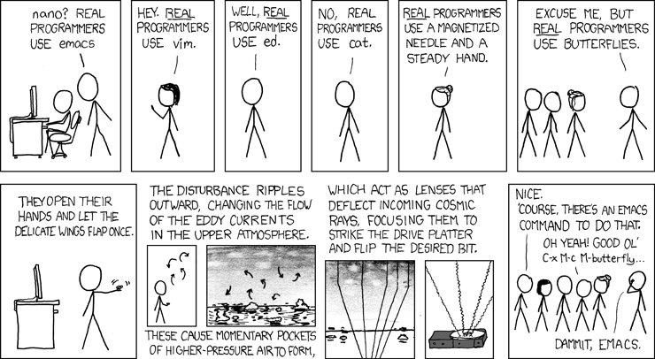
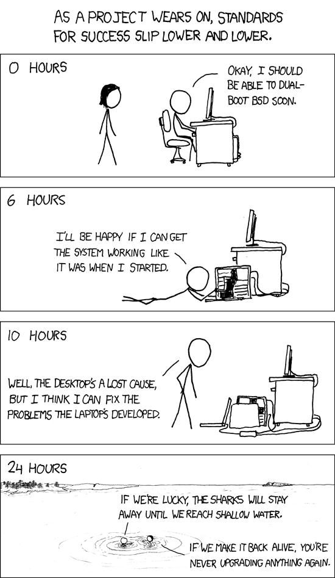
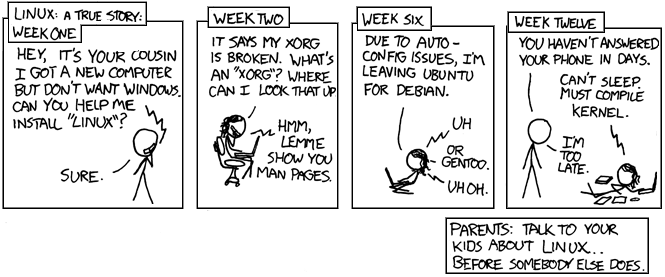

#+TITLE: CONFIG CONJURING WITH UNICORN MAGIC
#+AUTHOR: Toby Slight
#+DATE: 18/10/15
* Hello? Hello? What's all this shouting?
#+CAPTION: This is a local config, for local Lispers. There's nothing for you here.
#+NAME:fig:Edward_and_Tubbs
     
* We'll have no trouble here.

The culmination of years of [[http://projects.csail.mit.edu/gsb/old-archive/gsb-archive/gsb2000-02-11.html][yak-shaving]]...

All in one handy dandy git repo. Amazeballs.

* How does all this work?

I'm using Emacs' amazing org-mode as a configuration file management
system.

The functions defined in [[file:emacs/my-tangles.org][this]] file, allow automated tangling of the
files in this repository.

Please see the [[file:emacs/README.org][Emacs configuration directory]] for more details on how
this is implemented.

The main functions were inspired by this guy's blog:

[[http://fgiasson.com/blog/index.php/2016/10/26/literate-clojure-programming-tangle-all-in-org-mode/][Frederick Giasson's Literate Programming Blog]]

For more information on tangling, please see the following entries in
the org-mode manual:

[[https://orgmode.org/manual/Extracting-source-code.html][Extracting Source Code]]

[[https://orgmode.org/worg/org-contrib/babel/intro.html][Introduction to Org Babel]]

* Where can I see these mythical beasts?
*** Emacs

The main emacs configuration from which this strange odyssey of [[http://www.mncc.com.my/ossig/lists/general/2003-09/msg00143.html][sexp
worship]] & literate unicorn summoning springs is located [[file:emacs/README.org][here]].

#+BEGIN_QUOTE
I took a look at those nerds, and although a lot of their statements
are fun to read, I am not sure where the fun ends and the fanaticism
begins with many of them… (save-excursion (recursive-save-all)) be
with me…

– mangledmind
#+END_QUOTE

*It is full of [[https://orgmode.org/worg/org-faq.html#unicorn][unicorn]] wonder and lispy joy.*

#+CAPTION: Real Programmers
#+NAME:fig:real programmers
     

*** *BSD

Configuration files dedicated to the [[Http://www.unixprogram.com/churchofbsd/][Church of BSD]] ([[https://www.openbsd.org/][OpenBSD]] and
[[https://www.freebsd.org/][FreeBSD]]), are located [[file:openbsd/README.org][here]] and [[file:freebsd/][here]], respectively.

#+BEGIN_QUOTE
"One day I was at a restaurant explaining process control to one of my
disciples.  I was mentioning how we have to kill the children (child
processes) if they become unresponsive. Or we can even set an alarm
for the children to kill themselves.

That the parent need to wait (wait3) and acknowledge that the child
has died or else it will become a zombie.  The look of horror the
woman sitting across had was unforgettable.

I tried to explain it was a computer software thing but it was too
late, she fled terrified, probably to call the police or something. I
didn't really want to stick around too long to find out."

-- [[http://www.unixprogram.com/cgi-bin/man.cgi?comd%3Dps][man ps]]
#+END_QUOTE

*They are full of suicidal children and zombie parents...*

#+CAPTION: Success
#+NAME:fig:success
     

*** Linux

Those dedicated to the infernal penguin are [[./linux/README.org][here]].

#+BEGIN_QUOTE
"I must say the linux community is a lot nicer than the unix
community. a negative comment on unix would warrant death
threats. With linux, it is like stirring up a nest of butterflies."

-- Ken Thompson author of C Language. 1999
#+END_QUOTE

*Come and stir the butterflys...*

#+CAPTION: Cautionary
#+NAME:fig:cautionary
     

*** Proprietary

Evil proprietary systems are also catered for...

Cupertino's wickedness resides [[file:macos/README.org][here]], whilst Redmond's ghastliness
dwells in [[file:windows/README.org][this]] unspeakable den of inquity.

#+BEGIN_QUOTE
"They say when you play a Microsoft CD backwards you can hear satanic
messages...but that's nothing, if you play it forward it will install
Windows!"

-- [[Http://www.unixprogram.com/churchofbsd/][Church of BSD]]
#+END_QUOTE

#+CAPTION: Mac vs PC
#+NAME:fig:mac_pc
     

*** Stumpwm

A whole directory dedicated to [[https://stumpwm.github.io/][hacks and glory]]!

Your hacking starts... [[file:stumpwm/README.org][NOW!]]

#+BEGIN_QUOTE
Stumpwm is a "everything-and-the-kitchen-sink WM" or "the emacs of WMs."

StumpWM manages windows the way emacs manages buffers, or the way screen manages
terminals. If you want a flexible, customizable, hackable desktop experience,
look no further.

-- [[https://github.com/stumpwm/stumpwm][StumpWM GitHub]]
#+END_QUOTE

*** Agnostic

And finally, those poor agnostic souls, forever lost in OS purgatory,
are to be found [[./agnostic/README.org][here]].

* Will I be able to cope?

Prepare yourself ...

Yes, there are [[https://orgmode.org/worg/org-faq.html#unicorn][unicorns]]. Lots of [[https://orgmode.org/worg/org-faq.html#unicorn][unicorns]] ...

* Will more strangers come Edward?

Calm yourself Tubbs. None shall come.
