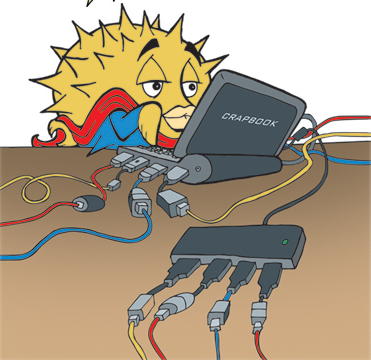

#+TITLE: PUFFY'S LAYER
#+AUTHOR: Toby Slight
#+DATE: 18/10/15
#+CAPTION: Puffy hard at work :-)
#+NAME:fig:Puffy_Hard_at_Work
#+ATTR_HTML: :style margin-left: auto; margin-right: auto;

[[./aliases.org][Shell Aliases]]

[[./apm.org][Advanced Power Management]]

[[./cwmrc.org][Calm Window Manager]]

[[./functions.org][Shell Functions]]

[[./fvwm.org][The F Virtual Window Manager 2.2.5]]

[[./ksh.org][The Korn Shell]]

[[./mg.org][Micro GNU Emacs]]

[[./nexrc.org][Vi Settings]]

[[./wsconsctl.org][wsconsctl config]]

[[./xdefaults.org][Xdefaults]]

[[./xenodm.org][Xenocara Display Manager]]

[[./xmodmap.org][Xmodmaps to the Stars (thanks to the Space Cadet)]]

[[./xsession.org][Xsession]]
