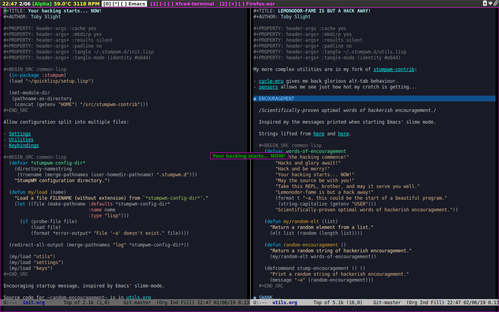

* HACKS AND GLORY AWAIT!

#+CAPTION: Screenshot
#+NAME:fig:screenshot
     

#+BEGIN_QUOTE
Stumpwm is a "everything-and-the-kitchen-sink WM" or "the emacs of WMs."

StumpWM manages windows the way emacs manages buffers, or the way screen manages
terminals. If you want a flexible, customizable, hackable desktop experience,
look no further.

-- [[https://github.com/stumpwm/stumpwm][StumpWM GitHub]]
#+END_QUOTE

** INSTALLATION
*** QUICKLISP

Get Quicklisp from [[https://www.quicklisp.org/beta/][here]]:

#+BEGIN_SRC bash
curl -O https://beta.quicklisp.org/quicklisp.lisp
curl -O https://beta.quicklisp.org/quicklisp.lisp.asc
gpg --verify quicklisp.lisp.asc quicklisp.lisp
#+END_SRC

Then load it into the REPL with:

#+BEGIN_SRC bash
sbcl --load quicklisp.lisp
#+END_SRC

From the REPL, install it:

#+BEGIN_SRC common-lisp
  (quicklisp-quickstart:install)
#+END_SRC

And make sure you have added it to your lisp init file using:

#+BEGIN_SRC common-lisp
  (ql:add-to-init-file)
#+END_SRC

Install stumpwm and some packages we need for niceties.

#+BEGIN_SRC common-lisp
  (ql:quickload :stumpwm)                ;; Install stumpwm
  (ql:quickload :xembed)                 ;; Required by stumptray
  (ql:quickload :clx-truetype)           ;; Required by ttf-fonts
  (ql:quickload :swank)                  ;; Required by slime-connect
  (ql:quickload :quicklisp-slime-helper) ;; Required by slime-connect
#+END_SRC

*** STARTUP FILES

Tangle this block to create a lisp file to start StumpWM in ~/usr/local/bin~:

#+BEGIN_SRC common-lisp :tangle /sudo::/usr/local/bin/stumpwm.lisp :tangle-mode (identity #o644)
  (require :stumpwm)
  (stumpwm:stumpwm)
#+END_SRC

This block creates a script in ~/usr/local/bin~ that loads the lisp above into
~sbcl~:

#+BEGIN_SRC common-lisp :tangle /sudo::/usr/local/bin/stumpwm.sh :tangle-mode (identity #o755)
  sbcl --load /usr/local/bin/stumpwm.lisp
#+END_SRC

Next add the following line to your .xinitrc to be able to run with ~startx~:

#+BEGIN_SRC bash :tangle ~/.xinitrc
  exec /usr/local/bin/stumpwm.sh
#+END_SRC

And/or tangle the block below to create a .desktop file to be read by your display
manager.

#+BEGIN_SRC conf :tangle /sudo::/usr/share/xsessions/stumpwm.desktop
  [Desktop Entry]
  Encoding=UTF-8
  Name=StumpWM
  Comment=Hacks and glory await!
  TryExec=stumpwm.sh
  Exec=/usr/local/bin/stumpwm.sh
  Type=Application
  [X-Window Manager]
  SessionManaged=true
#+END_SRC

*** CONFIG

Finally, now that we have StumpWM installed and ready to be started with either
~startx~ or from a display manager, we need to tangle the code in the files
linked below:

- [[file:init.org][Initialisation]]
- [[file:settings.org][Settings]]
- [[file:utils.org][Utilities]]
- [[file:keys.org][Keybindings]]

Please see the main [[file:../README.org][etc repo README]] for more details on Emacs tangling,
org-mode, literate programming and how I manage configuration files and such.

** INSPIRATIONS

https://dataswamp.org/~solene/2016-06-06-stumpwm.html

https://github.com/areina/stumpwm.d

https://github.com/stumpwm/stumpwm/wiki/Customize
