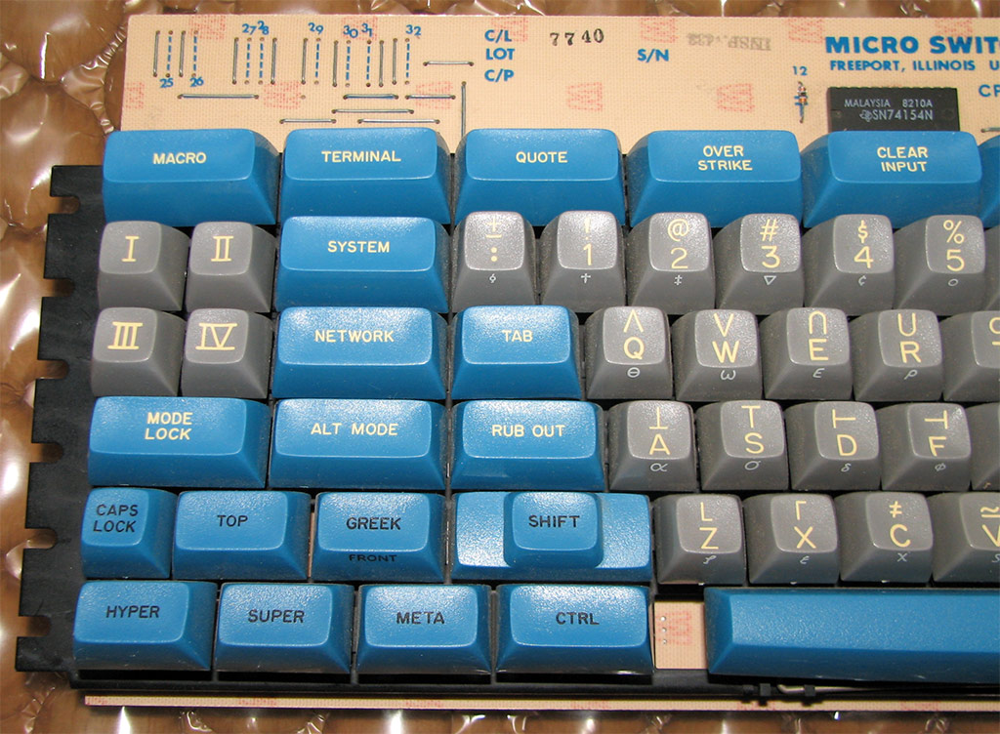

#+TITLE: LINUX SPACE CADET KEYBOARD REMAPPING
#+PROPERTY: header-args :cache yes
#+PROPERTY: header-args+ :mkdirp yes
#+PROPERTY: header-args+ :tangle-mode (identity #o644)
#+PROPERTY: header-args+ :results silent
#+PROPERTY: header-args+ :padline yes
#+PROPERTY: header-args+ :tangle /sudo::/etc/udev/hwdb.d/90-sc-kbd.hwdb

For maximum Emacs comfort, I remap my keyboard to conform to the Symbolics'
[[http://xahlee.info/kbd/space-cadet_keyboard.html][Space-Cadet]] Lisp Machine keyboard layout. This was the keyboard Emacs' was
originally written on/with.

#+CAPTION: The Venerable Space Cadet Keyboard
#+NAME:fig:Space_aCadet

This layout not only makes so much more sense for Emacs, but for most other
applications too. Typically the Control key is the most commonly used modifier,
followed by Alt /(Meta)/, and then the Super /(Windows)/ key.

It makes the most sense to me, to have the most used modifiers accessible with
one's strongest digits (the thumbs), and the least used modifiers using the
weakest digit - one's pinkies.

It also means that your modifiers are symmetrical, so you can use them in the
same touch-typing fashion as the shift key (ie. one hand presses modifier, the
other, the modified key).

In addition I also switch the Escape and CapsLock keys, because I still use Vim
from time to time...

There are a variety of ways to achieve this on Linux - ~setxkbmap~, ~xmodmap~
or with ~udev~. I choose the latter as it remaps at a lower level and therefore
works in X11, Wayland and a tty. Whereas the former only work in X11.

* INSTALL

*This will only work if your hardware is listed in the "KEYBOARDS" section
below*

If it isn't please follow the "MODIFY" instructions, and I'd be very
grateful if you'd also followed the "CONTRIBUTE" instructions and
helped out the next guy...

Providing your hardware is supported, execute the code block below
after tangling this file, and everything should /'just werk'/ (TM).

#+begin_src shell :dir /sudo:: :tangle no
systemd-hwdb update && udevadm trigger
udevadm info /dev/input/event* | grep -E 'caps|esc|meta|alt|ctrl'
#+end_src

* MODIFY

We need to create a new file at ~/etc/udev/hwdb.d~ that has a section that
references our keyboard identifier and underneath declares which scancodes map
to which keycodes (see [[file:kbd.hwdb][kbd.hwdb]] or the examples below).

[[https://wiki.archlinux.org/index.php/Map_scancodes_to_keycodes][Map Scancodes to Keycodes]]

To find the correct keycodes use the ~evtest~ utility with the path to the
input device as the parameter, eg. ~/dev/input/event0~.

#+BEGIN_SRC sh :tangle no
  sudo evtest /dev/input/event0
#+END_SRC

If you run ~evtest~ with no argument it should ask you which device you want to
test, and which one is the keyboard /should/ be obvious..

*N.B.* ~evtest~ needs to be run as root to work.

The keycode is the unique identifier after the string "value".

One thing to note is that Meta refers to Super in the output from evtest, not
Alt as you might expect.

For examples of how to derive the keyboard type matching rule, check [[https://github.com/systemd/systemd/blob/master/hwdb/60-keyboard.hwdb][here]].

Also, ~/usr/include/linux/input.h~ may be of use... Good luck!

You can get also the keyboard identifier with:

#+BEGIN_SRC sh :tangle no
  cat /proc/bus/input/devices | grep -i keyboard -A 9 -B 1
#+END_SRC

*N.B.* Make sure all the of the keyboard identifier string is capitalised apart
from the section delimiters... (~b****v***p***~)

Finally one needs to run:

#+BEGIN_SRC sh :tangle no
  sudo systemd-hwdb update && sudo udevadm trigger
#+END_SRC

To check this has worked, run the following:

#+BEGIN_SRC sh :tangle no
  udevadm info /dev/input/event* | grep -E 'caps|esc|meta|alt|ctrl'
#+END_SRC

* KEYBOARDS
** APPLE
*** Apple MacBook Pro M1
#+begin_src conf
  # Apple MacBook Pro M1
  evdev:input:b001Cv05ACp0342*
    KEYBOARD_KEY_70039=esc
    KEYBOARD_KEY_70029=capslock
    KEYBOARD_KEY_700e7=rightctrl # command
    KEYBOARD_KEY_700e6=leftalt # option
    KEYBOARD_KEY_70050=rightmeta # left arrow
    KEYBOARD_KEY_700e3=leftctrl
    KEYBOARD_KEY_700e2=leftalt
    KEYBOARD_KEY_700e0=leftmeta
#+end_src
*** Apple MacBook Pro OG
#+begin_src conf
  # Apple MacBook Intel
  evdev:input:b0003v05ACp02*
    KEYBOARD_KEY_70029=capslock      # esc       --> caps
    KEYBOARD_KEY_70039=esc           # caps      --> esc
    KEYBOARD_KEY_700e3=leftctrl      # leftcmd   --> leftctrl
    KEYBOARD_KEY_700e7=leftctrl      # rightcmd  --> leftctrl
    KEYBOARD_KEY_700e2=leftalt       # leftopt   --> leftalt
    KEYBOARD_KEY_700e6=leftalt       # rightopt  --> leftalt (to avoid altgr shit)
    KEYBOARD_KEY_700e0=leftmeta      # leftctrl  --> super
    KEYBOARD_KEY_70050=leftmeta      # leftarrow --> super
#+end_src
*** Apple MacBook Pro OG JIS
#+begin_src conf
  # Apple MacBook Intel JIS
  evdev:input:b0003v05ACp029*
    KEYBOARD_KEY_70029=capslock
    KEYBOARD_KEY_70039=fn
    KEYBOARD_KEY_70090=leftctrl
    KEYBOARD_KEY_70091=leftctrl
    KEYBOARD_KEY_700e7=leftalt
    KEYBOARD_KEY_700e3=leftalt
    KEYBOARD_KEY_700e2=leftmeta
    KEYBOARD_KEY_700e0=esc
    KEYBOARD_KEY_70089=backspace
    KEYBOARD_KEY_70087=grave
    KEYBOARD_KEY_ff0003=rightmeta
#+end_src
** DELL
*** Dell XPS 13 L322X
#+begin_src conf
  # Dell XPS 13 L322X
  evdev:atkbd:dmi:bvn*:bvr*:svnDellInc.:pnXPSL322X:pvr:rvnDellInc.*
    KEYBOARD_KEY_01=capslock         # esc   --> caps
    KEYBOARD_KEY_3a=esc              # caps  --> esc
    KEYBOARD_KEY_38=leftctrl         # alt   --> leftctrl
    KEYBOARD_KEY_db=leftalt          # super --> leftalt
    KEYBOARD_KEY_1d=leftmeta         # ctrl  --> super
    KEYBOARD_KEY_b8=leftctrl         # altgr --> leftctrl
    KEYBOARD_KEY_9d=leftalt          # ctrl  --> leftalt
    KEYBOARD_KEY_cb=leftmeta         # left  --> rightmeta
#+end_src
** MICROSOFT
*** Microsoft Natural Ergonomic Keyboard 4000
#+BEGIN_SRC conf
  # Microsoft Natural Ergonomic Keyboard 4000
  evdev:input:b0003v045Ep00DB*
    KEYBOARD_KEY_70029=capslock      # esc   --> caps
    KEYBOARD_KEY_70039=esc           # caps  --> esc
    KEYBOARD_KEY_700e2=leftctrl      # alt   --> leftctrl
    KEYBOARD_KEY_700e3=leftalt       # super --> leftalt
    KEYBOARD_KEY_700e0=leftmeta      # ctrl  --> super
    KEYBOARD_KEY_700e6=leftctrl      # altgr --> leftctrl
    KEYBOARD_KEY_70065=leftalt       # menu  --> leftalt
    KEYBOARD_KEY_700e4=leftmeta      # ctrl  --> leftmeta
#+END_SRC
*** Microsoft Sculpt Ergonomic Keyboard
Shows up in ~/proc/bus/input/devices~ as "Microsoft Microsoft® Nano Transceiver v2.1"
#+begin_src conf
  # Microsoft Sculpt Ergonomic Keyboard
  evdev:input:b0003v045Ep07A5*
    KEYBOARD_KEY_70029=capslock      # esc   --> caps
    KEYBOARD_KEY_70039=esc           # caps  --> esc
    KEYBOARD_KEY_700e2=leftctrl      # alt   --> leftctrl
    KEYBOARD_KEY_700e3=leftalt       # super --> leftalt
    KEYBOARD_KEY_700e0=leftmeta      # ctrl  --> super
    KEYBOARD_KEY_700e6=leftctrl      # altgr --> leftctrl
    KEYBOARD_KEY_70065=leftalt       # menu  --> leftalt
    KEYBOARD_KEY_700e4=leftmeta      # ctrl  --> leftmeta
#+end_src
*** Microsoft Wired USB
#+BEGIN_SRC conf
  # Microsoft Wired USB Keyboard
  evdev:input:b0003v045Ep0752*
    KEYBOARD_KEY_70029=capslock      # esc   --> caps
    KEYBOARD_KEY_70039=esc           # caps  --> esc
    KEYBOARD_KEY_700e2=leftctrl      # alt   --> leftctrl
    KEYBOARD_KEY_700e3=leftalt       # super --> leftalt
    KEYBOARD_KEY_700e0=leftmeta      # ctrl  --> super
    KEYBOARD_KEY_700e6=leftctrl      # altgr --> leftctrl
    KEYBOARD_KEY_700e7=leftalt       # super --> leftalt
    KEYBOARD_KEY_70065=leftmeta      # menu  --> leftmeta
    KEYBOARD_KEY_700e4=menu          # ctrl  --> menu
#+END_SRC
** LENOVO
*** Lenovo Thinkpad Bluetooth Chicklet
#+BEGIN_SRC conf
  # Lenovo Thinkpad Bluetooth Chicklet
  evdev:input:b0005v17EFp6048*
    KEYBOARD_KEY_70029=capslock         # esc   --> caps
    KEYBOARD_KEY_70039=esc              # caps  --> esc
    KEYBOARD_KEY_700e2=leftctrl         # alt   --> leftctrl
    KEYBOARD_KEY_700e6=leftctrl         # altgr --> leftctrl
    KEYBOARD_KEY_700e3=leftalt          # super --> leftalt
    KEYBOARD_KEY_70046=leftalt          # prtsc --> leftalt (to avoid altgr shit)
    KEYBOARD_KEY_700e0=leftmeta         # ctrl  --> super
    KEYBOARD_KEY_700e4=leftmeta         # ctrl  --> super
#+END_SRC
*** Lenovo ThinkPad Chicklet
#+BEGIN_SRC conf
  # Lenovo ThinkPad post 2012
  evdev:atkbd:dmi:bvn*:bvr*:bd*:svnLENOVO:pn*:pvrThinkPad*
    KEYBOARD_KEY_01=capslock         # esc   --> caps
    KEYBOARD_KEY_3a=esc              # caps  --> esc
    KEYBOARD_KEY_38=leftctrl         # alt   --> leftctrl
    KEYBOARD_KEY_b8=leftctrl         # altgr --> leftctrl
    KEYBOARD_KEY_db=leftalt          # super --> leftalt
    KEYBOARD_KEY_b7=leftalt          # prtsc --> leftalt (to avoid altgr shit)
    KEYBOARD_KEY_1d=leftmeta         # ctrl  --> super
    KEYBOARD_KEY_9d=leftmeta         # ctrl  --> super
#+END_SRC
*** Lenovo ThinkPad T/W/X OG
#+BEGIN_SRC conf
  # Lenovo ThinkPad T & X series pre 2012
  evdev:atkbd:dmi:bvn*:bvr*:bd*:svnLENOVO:pn*:pvrThinkPad[TWX][246][0-2]*
    KEYBOARD_KEY_01=capslock         # esc   --> caps
    KEYBOARD_KEY_3a=esc              # caps  --> esc
    KEYBOARD_KEY_b8=leftctrl         # altgr --> rctrl
    KEYBOARD_KEY_38=leftctrl         # alt   --> lctrl
    KEYBOARD_KEY_db=leftalt          # lwin  --> lalt
    KEYBOARD_KEY_dd=leftalt          # menu  --> lalt, not altgr (hence left)
    KEYBOARD_KEY_9d=leftmeta         # rctrl --> rwin
    KEYBOARD_KEY_1d=leftmeta         # lctrl --> lwin
#+END_SRC
** PINE64
*** Pinebook Pro
#+begin_src conf
  # Pinebook Pro
  evdev:input:b0003v258Ap001E*
    KEYBOARD_KEY_70029=capslock         # esc   --> caps
    KEYBOARD_KEY_70039=esc              # caps  --> esc
    KEYBOARD_KEY_700e6=leftctrl         # alt   --> ctrl
    KEYBOARD_KEY_700e2=leftctrl         # altgr --> ctrl
    KEYBOARD_KEY_700e4=leftalt          # super --> alt
    KEYBOARD_KEY_700e3=leftalt          # ctrl  --> alt
    KEYBOARD_KEY_700e0=leftmeta         # left  --> meta
    KEYBOARD_KEY_70050=leftmeta         # ctrl  --> meta
#+end_src
